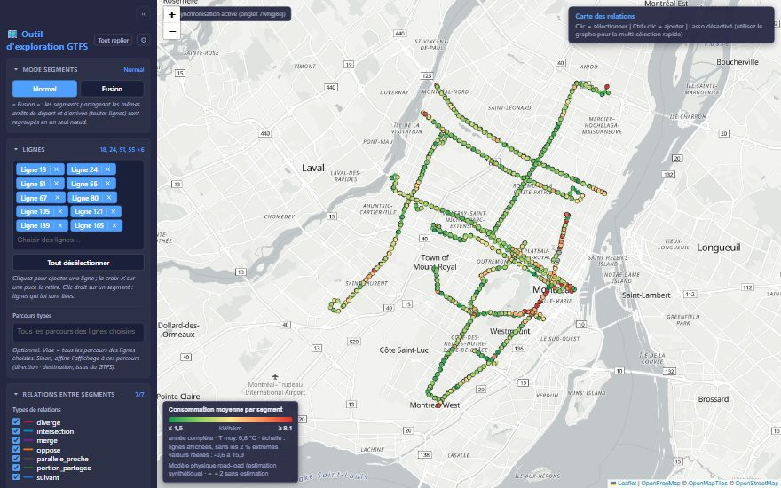
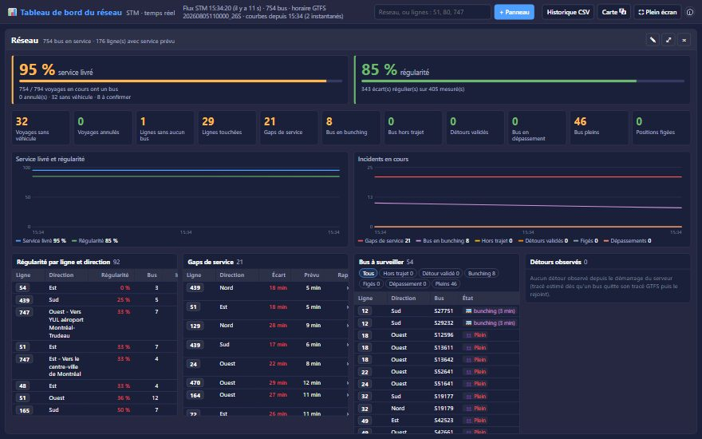
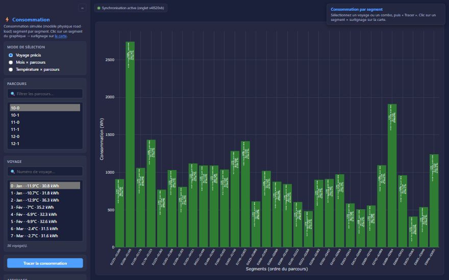

# Outil d'exploration GTFS — réseau d'autobus de Montréal

**Explorer, analyser et surveiller en temps réel un réseau de transport, à partir
de données 100 % ouvertes.** Le réseau de la STM est découpé en 15 825 segments
reliés par 105 653 relations typées ; le même graphe sert à estimer la
consommation d'énergie d'un bus électrique et à mesurer la fiabilité du service
en temps réel (GTFS-Realtime).

**▶ Présentation : <https://potatoesfra.github.io/Visualisation_reseau_transport/>**
· **Démo en ligne : <https://visualisation-reseau-transport.onrender.com>**
*(hébergement gratuit : le premier chargement peut prendre 30 à 60 s, le temps
que le serveur se réveille)*

> **Avertissement** — Application développée à titre de projet de formation en développement web. Il ne s'agit pas d'une application officielle de la STM et elle n'est ni affiliée, ni approuvée par la STM. Données GTFS-realtime fournies par la Société de transport de Montréal (STM) sous licence CC-BY 4.0. Ces données sont fournies « telles quelles », sans garantie d'exactitude ou de disponibilité.



| Tableau de bord temps réel | Consommation par segment |
|---|---|
|  |  |
| *Aperçu généré sur un flux temps réel simulé (`scripts/capturer_apercus.py`)* | *Modèle physique road-load : estimation, pas une mesure* |

## Ce que ce projet démontre

- **Ingénierie de données ouvertes** — pipeline reproductible (`pipeline/p01`→`p08`)
  qui croise GTFS, OpenStreetMap, MNT Copernicus, données ouvertes de Montréal et
  normales climatiques en un graphe de segments attribué (pente, feux, vitesse,
  état de chaussée…) et un graphe routier routable.
- **Temps réel GTFS-RT** — proxy à cache partagé calé sur le rythme de publication
  du flux (actualisation ~2 s après chaque version, un seul appel STM quel que
  soit le nombre de visiteurs) ; service prévu vs service livré, **bus bunching**
  et **gaps de service**, **détours** estimés sur le réseau routier et validés
  rue par rue quand au moins deux bus les empruntent.
- **Modélisation** — modèle physique *road-load* d'un bus électrique (traction,
  récupération, chauffage/climatisation selon la température), simulation
  seconde par seconde, prévision énergétique par segment et par ligne.
- **Produit** — carte Leaflet, graphe Cytoscape, tableau de bord plein écran
  multi-panneaux (tris, filtres, historique exportable), pages synchronisées entre
  onglets, visite guidée sur chaque page.
- **Standards d'ingénierie** — tests `pytest`, configuration par variables
  d'environnement, secret jamais versionné, mode statique qui tient dans les
  512 Mo d'un hébergement gratuit, démo publique en lecture seule.

**In English** — An open-source GTFS / GTFS-Realtime exploration tool for the
Montréal (STM) bus network, built exclusively on open data. It models the network
as a graph of stop-to-stop segments with typed relations, estimates electric-bus
energy use with a physics-based road-load model, and monitors live service
(delivered vs scheduled trips, bus bunching, service gaps, detours inferred on
the road network) from the STM GTFS-Realtime feed. Python (Flask, pandas,
GeoPandas), Leaflet, Cytoscape, Plotly; UI in French.

---

## Contexte

Application Flask de visualisation et d'analyse du réseau d'autobus,
construite **exclusivement à partir de données ouvertes** : GTFS (STM),
OpenStreetMap, MNT Copernicus, données ouvertes de la Ville de Montréal et
normales climatiques d'Environnement Canada.

Le réseau est découpé en **segments** (portions de tracé entre deux arrêts
consécutifs d'une ligne), reliés entre eux par des **relations** typées
(suivant, portion partagée, intersection, merge, diverge, opposé, parallèle
proche). Chaque segment porte des attributs géographiques (pente, altitude,
sinuosité), routiers (type de voie, limite de vitesse, feux, état de la
chaussée) et énergétiques (modèle physique *road-load* d'un bus).

> **Note** — Les consommations affichées sont **simulées** par un modèle
> physique documenté (aucune donnée mesurée) : elles illustrent la mécanique de
> visualisation et les ordres de grandeur, pas des mesures réelles.

## Les six pages

| Page | URL | Contenu |
|---|---|---|
| Outil d'exploration (carte) | `/` | Carte Leaflet : segments, relations, arrêts, overlay relief, **réseau routier routable**, **bus en temps réel** (GTFS-RT STM, colorés par occupation, restreints automatiquement aux lignes/directions sélectionnées — avec un avis si aucun véhicule n'y circule ou si des bus y sont hors trajet —, ⚠ si hors du tracé GTFS de leur trajet, bouton « Afficher hors trajet » pour ne garder que les détours ; clic = focus sur un bus, Ctrl+clic = multi-sélection, avec affichage des tracés de leurs trajets et suivi), **tableau de bord réseau** (service prévu vs réel : voyages livrés, annulés, sans véhicule ; bus hors trajet, en dépassement, pleins, figés), **outil de création de trajet** (routage sur le réseau routier réel + estimation d'énergie) |
| Graphe | `/graphe` | Graphe abstrait Cytoscape : nœuds = segments, arêtes = relations typées |
| Graphe de calcul | `/graphe_calcul` | Arbre de voisinage avec moteur physique |
| Consommation | `/consommation` | Profils de consommation simulée par segment (Plotly) : par voyage, par mois ou par plage de température |
| Simulation | `/simulation` | Profil vitesse / puissance seconde par seconde d'un voyage, avec **lecture animée** |
| Tableau de bord | `/tableau_de_bord` | Tableau de bord temps réel plein écran : panneaux réseau ou lignes côte à côte, indicateurs, courbes, tableaux triables et filtrables, historique CSV |

**Visite guidée** : sur chaque page, un « tour du propriétaire » s'ouvre une fois
par lancement du serveur (passable, ou « Ne plus l'afficher ») : une page sur
l'interface, puis une par section du menu de gauche, mise en surbrillance
(précédent / suivant, ← → au clavier). Le bouton **?** en bas à droite de la
carte le relance à tout moment (`serveur/static/visite_guidee.js`).

Les pages ouvertes dans plusieurs onglets/fenêtres se **synchronisent**
automatiquement (BroadcastChannel) : sélectionner un segment sur une page le
surligne sur les autres.

> **Mode allégé (`VIZ_LIGHT=1`)** — pour l'hébergement à faible RAM (voir
> [Déploiement](#déploiement)), le serveur saute au démarrage le **mode
> fusion**, la **Consommation** et la **Simulation** (qui dépend de la conso) :
> ces pages nécessitent des données volumineuses non incluses dans les
> payloads statiques. Les pages **Carte**, **Graphe** et **Graphe de calcul**
> restent actives (purement côté client, aucun coût RAM serveur). Les
> contrôles des fonctionnalités absentes sont masqués. En local (variable non
> définie), tout reste chargé.

### Prévision énergétique sur la carte

La section « Prévision énergétique » de la carte colore les segments affichés
selon la consommation estimée par le **modèle physique road-load** (traction +
chauffage, `pipeline/p06_conso_synthetique.py`), du vert (plus faible) au rouge
(plus élevée) :

- **Consommation par segment** : moyenne d'un passage sur chaque segment ;
  **Consommation totale** : moyenne d'un voyage complet, toute la
  ligne-direction prend une seule couleur ;
- en **kWh** (énergie sur l'unité : passage ou voyage) ou en **kWh/km** ;
- sur une **plage de mois** (préréglages hiver, été…, plage à cheval sur
  l'année acceptée) ;
- échelle calculée sur ce qui est affiché : toutes les lignes, ou seulement la
  ligne / direction choisie (option : échelle du réseau entier, et option
  pour ignorer les 2 % de valeurs extrêmes — segments très courts ou en forte
  descente).

Les agrégats (sommes mensuelles par segment et par ligne-direction) sont
servis par `/api/energie/carte` ; ils sont aussi exportés dans les payloads
statiques (`energie_carte.json.gz`, 0,5 Mo) pour que la démo en ligne en
dispose. Il s'agit d'une **estimation synthétique**, pas d'une mesure.

### Outil de création de trajet

Le bouton « Outil de création de trajet » (page carte) ouvre une carte en
surimpression dédiée à la construction d'un parcours :

- chaque clic ajoute un **jalon** ; l'itinéraire est calculé par Dijkstra sur le
  graphe routier OSM (`p08`) — le tracé suit les rues ;
- les jalons se **réordonnent** (▲ ▼), se suppriment (✕ ou clic droit sur le
  marqueur) et se déplacent par glisser-déposer ;
- le bouton 📍 propose les **arrêts existants les plus proches** ; en choisir un
  replace le jalon exactement sur cet arrêt ;
- l'énergie du trajet est estimée par le modèle *road-load* (traction, chauffage
  ou climatisation selon le mois, auxiliaires), avec la charge de passagers en
  paramètre ;
- un tracé peut être déplacé pour passer par une autre rue, il suffit de clic droit sur
  le segment d'intérêt;
- « Exporter la ligne » enregistre le trajet sous le nom choisi : il rejoint le
  groupe **★ Lignes créées** du sélecteur « Lignes affichées » et devient
  sélectionnable comme n'importe quelle ligne. Les lignes créées sont conservées
  dans le `localStorage` du navigateur (elles ne sont pas écrites sur le serveur).
  Les caractéristiques de ligne (longueur, dénivelé...) sont alors estimées pour la nouvelle
  ligne afin d'afficher les mêmes informations qu'une ligne legacy du flux GTFS.

### Lecture animée de la simulation

La page Simulation rejoue le voyage en temps réel (ou ×2, ×4, ×10), avec
pause et déplacement libre dans le temps :

- une **barre d'avancement** verticale parcourt les graphiques de vitesse et de
  puissance ;
- une **icône de bus** progresse simultanément sur le tracé du voyage dans
  l'onglet carte, positionnée par intégration de la vitesse le long du segment
  courant.

Sur la page Consommation, sélectionner une observation trace également le
voyage correspondant sur la carte. Le tracé fonctionne dans les deux modes :
en mode fusion, les identifiants de segments sont traduits via la table de
liaison, car un même entier n'y désigne pas le même nœud. Le mode fusion permet 
de passer d'un calcul par ligne à un calcul partagé. Un segment défini par deux arrêts, 
même s'il commence et se termine à des arrêts identiques entre plusieurs lignes de bus va générer
plusieurs segments dans le graphe. En mode fusion, deux arrêts définissent un segment qui peut être 
partagé par plusieurs lignes de bus. 

## Installation

```bash
python -m venv .venv
.venv\Scripts\activate          # Windows  (source .venv/bin/activate sur Linux/Mac)
pip install -r requirements.txt
```

## Démarrage rapide (dérivés versionnés)

Les fichiers de `data_derivee/` sont versionnés : l'application fonctionne dès
le clone, sans télécharger les données brutes.

```bash
python serveur/serveur_viz.py
# puis ouvrir http://127.0.0.1:5000/
```

L'overlay « réseau routier routable » de la carte est dérivé du graphe de
routage (`data_derivee/`, versionné) : il ne dépend d'aucune donnée brute et
fonctionne dès le clone.

## Déploiement

Le serveur lit ses variables d'environnement via `config.py` :

| Variable | Rôle | Défaut |
|---|---|---|
| `VIZ_HOTE` / `VIZ_PORT` | hôte / port d'écoute | `127.0.0.1` / `5000` |
| `PORT` | port imposé par un PaaS (Render, Heroku…) : bascule automatiquement l'écoute sur `0.0.0.0:$PORT` | — |
| `VIZ_LIGHT` | `1` = mode allégé (saute fusion + consommation + simulation, désactive Graphe/Graphe de calcul) | non défini |
| `VIZ_FORCE_CALCUL` | `1` = force la reconstruction dynamique même si les payloads statiques existent (utilisé par l'exporteur, sinon inutile) | non défini |
| `STM_API_KEY` | clé GTFS-Realtime du [portail développeurs STM](https://portail.developpeurs.stm.info/apihub/) (gratuite) : active la couche « bus en temps réel » et le collecteur. **Secret — jamais versionné** (Render : saisie dans le tableau de bord) | non défini (couche désactivée) |
| `VIZ_DETOURS_ACTIONS` | `1` / `0` : autorise ou non les actions manuelles sur les détours (valider, supprimer, sourdine, tracer), qui modifient l'état partagé par tous les visiteurs | autorisées en local, **lecture seule** sur un hébergeur (`PORT` défini) |

### Mode statique — calcul en local, rendu en ligne

Le calcul des payloads (segments, relations, arrêts, réseau routier) est
**fait une fois en local**, sur un poste avec assez de RAM, puis versionné :

```bash
python scripts/exporter_payloads_statiques.py
```

Ceci écrit `data_derivee/payloads_statiques/*.json.gz` (~6,5 Mo au total,
compressés ~5× — uniquement pour alléger le dépôt Git, pas pour le réseau).
Tant que `VIZ_LIGHT=1` **et** que ce dossier existe, le serveur les
**décompresse une seule fois au démarrage** en chaînes JSON tenues en mémoire,
puis les sert telles quelles (même mécanisme que la compaction du mode
dynamique) : **`geopandas`/`shapely` ne sont jamais importés**, il n'y a plus
aucune reconstruction ni pic de RAM au boot. Les routes `/api/*` renvoient du
JSON brut, sans `Content-Encoding` manuel — poser cet en-tête à la main sur un
fichier pré-compressé est fragile derrière un proxy PaaS (risque de double
compression ou de décodage cassé côté navigateur, déjà rencontré sur Render).
Seul le graphe routier (p08, pour le routage Dijkstra des trajets créés) reste
chargé en mémoire — c'est la seule chose encore « calculée » en ligne.

RSS mesuré (VIZ_LIGHT + payloads statiques) : **~180 Mo au démarrage, ~315 Mo
au pic** (après une estimation de trajet) — large marge sur une instance
512 Mo Render, contre 740 Mo en mode complet sans aucune optimisation.

À relancer après toute régénération du pipeline (p01–p08), puis committer
`data_derivee/payloads_statiques/`.

### Référentiel temps réel (GTFS en vigueur)

La couche « bus en temps réel » s'appuie sur un référentiel distinct,
`payloads_statiques/referentiel_rt.json.gz` (~1,4 Mo) : pour chaque trajet du
GTFS **en vigueur**, son tracé (simplifié à 3 m), sa direction, sa ligne, son
service, ses heures de début et de fin et sa destination, plus le calendrier
des services (`calendar.txt` + exceptions). `stop_times.txt` (~200 Mo) n'est lu
que par l'exporteur, par blocs : le serveur ne le charge jamais.

```bash
python scripts/exporter_referentiel_rt.py        # télécharge le GTFS STM courant
```

Il est séparé du pipeline pour trois raisons, mesurées sur le flux réel :

- les `trip_id` changent à chaque publication du GTFS : ceux du flux temps réel
  sont introuvables dans une version antérieure ;
- le `direction_id` du flux temps réel contredit celui du GTFS pour ~30 % des
  trajets : la direction affichée et filtrée est celle du GTFS ;
- l'écart d'un bus au tracé de **son** trajet (médiane 3 m, p95 15 m) signale
  les détours : au-delà de 150 m, un ⚠ s'affiche (~4 % des bus).

À relancer à chaque nouveau GTFS STM (la ligne de statut de la couche signale un
référentiel périmé quand plus de 20 % des trajets du flux y sont inconnus),
puis committer le fichier.

### Tableau de bord réseau (service prévu vs service réel)

Barre en bas de la carte (la carte se réduit d'autant), affichée dès que la
couche temps réel est active ; la case « Tableau de bord (barre du bas) » ou
le × permettent de la masquer (choix mémorisé dans le navigateur). Elle porte
sur les lignes sélectionnées, sinon sur tout le réseau. Le calcul
(`serveur/service_prevu.py`, testé dans `tests/test_service_prevu.py`) classe
chaque voyage **prévu en cours** d'après l'horaire en vigueur (trajets après
minuit rattachés au jour de service de la veille) :

| Statut | Définition |
|---|---|
| livré | un véhicule l'a porté dans le flux positions depuis son début (mémoire de 6 h côté serveur : un bus qui finit en avance reste « livré ») |
| annulé | `schedule_relationship = CANCELED` dans `tripUpdates` (la STM publie aussi les annulations à venir) |
| sans véhicule | ni vu ni annulé, en cours depuis ≥ 5 min et fini dans ≥ 2 min |
| à confirmer | ni vu ni annulé, trop près du début ou de la fin pour conclure |

Ces marges viennent du flux réel : les bus sont affectés à leur trajet suivant
~5 min avant son début et finissent ~6 min après la fin prévue. « Sans
véhicule » signifie « absent du flux » : voyage non livré, ou bus qui ne
transmet pas.

Tuiles cliquables : **listes** (voyages sans véhicule, annulés et annulations
dans l'heure, lignes sans aucun bus, lignes touchées ; clic sur une ligne = la
sélectionner sur la carte) et **filtres** de la carte (bus hors trajet, en
dépassement de plus de 5 min de la fin prévue, pleins, à position figée depuis
plus de 3 min).

**Page plein écran** `/tableau_de_bord` (bouton « 📊 Tableau de bord plein
écran » de la section « Bus en temps réel ») : tableau de bord de performance
sans carte, en **écran partagé** — un panneau par périmètre (réseau, une ligne,
plusieurs lignes), par exemple le réseau à gauche et la ligne qu'on surveille à
droite. Chaque panneau : service livré, régularité, tuiles d'incidents,
**courbes depuis l'ouverture de l'onglet**, tableaux (régularité par
ligne/direction, gaps de service, bus à surveiller, voyages non livrés) et événements.
Clic sur un numéro de ligne = l'ouvrir dans un nouveau panneau. Tous les
tableaux se **trient** (clic sur un titre de colonne : croissant ↔ décroissant)
et se **filtrent** (entonnoir au survol : valeurs à cocher, bornes min/max,
texte, plage horaire), panneau par panneau ; un bandeau en haut compte les
filtres actifs et permet de les modifier ou de tout supprimer. La
configuration est dans l'adresse (`/tableau_de_bord#reseau|51,80|747`), donc
partageable. Les agrégats sont ceux de la barre de la carte
(`serveur/static/rt_commun.js`, partagé par les deux pages).

**Détours observés** (`serveur/detours.py`) : quand un bus quitte le tracé GTFS
de son voyage (> 150 m), le serveur estime son tracé sur le **réseau routier
routable** (p08) : chaque position doit être à moins de 40 m d'une rue, et
deux positions successives sont reliées par le plus court chemin (sens de
circulation respecté, recherche bornée). Les sorties qui commencent au terminus
ou ne rejoignent pas le tracé (changement de voyage) sont écartées, et les rues
de tête et de queue confondues avec le tracé normal sont rognées. La validation
se fait **rue par rue** : sur la carte, une portion est en **pointillés jaunes**
tant qu'un seul bus l'a empruntée, en **tirets orange** dès que **2 bus** de la
même ligne/direction y sont passés (un bus encore dans son détour ne valide que
ce qu'il a déjà parcouru ; un prolongement ou une variante empruntés par un seul
bus restent jaunes). Le détour est **validé** quand 80 % de son tracé l'est, et
un bus passe de « hors trajet » à « détour validé » quand 80 % de son chemin a
aussi été emprunté par un autre bus. Un bus hors tracé sans tracé estimé en
donne la raison dans son infobulle (sortie non observée, terminus, positions
hors réseau…). Les
détours validés ont leur tuile dans les deux tableaux de bord, un tableau dans
la page plein écran, une courbe et des événements d'historique. Un détour validé
**remplace la portion du tracé qu'il contourne dans le calcul du bus bunching
et des gaps de service** : ses bus sont placés sur le parcours réel, et un gap y est tracé
par le détour. **Clic droit sur un tracé** : le valider manuellement, le
supprimer (au choix : sourdine de la ligne/direction pendant N minutes ou
jusqu'à la fin de la session — rechargement de la page ou redémarrage du
serveur), ou le retracer à la main ; « ✏ Tracer un détour » dessine un détour
point par point, relié par les rues et validé d'office. Ces actions modifient
l'état du serveur (partagé par la carte et le tableau de bord). **Détour 1 bus** :
si un détour potentiel (un seul bus) n'est pas repris — le bus suivant de la
ligne/direction franchit sur le tracé normal la portion contournée, ou aucun
bus ne l'emprunte pendant 45 min —, il quitte la carte et devient un événement
« Détour 1 bus » de l'historique (mouvement anormal ponctuel). Un clic sur
l'événement le retrace : positions GPS, tracé estimé sur les rues, portion
normale contournée, et statistiques (bus, voyage et heure de départ, heure et
durée hors tracé, distance parcourue et distance ajoutée).

**Historique** (section du panneau de la carte, et bloc « Événements » de la
page plein écran) : gaps de service, bus bunching, bus hors trajet, figés, en dépassement,
pleins, annulations, lignes sans bus et pannes du flux, suivis en *épisodes*
(début, fin, pire valeur) depuis l'ouverture de la page ; export CSV.

### Régularité : bus bunching et gaps de service

Calcul côté serveur (`serveur/regularite.py`, testé dans `tests/test_regularite.py`),
sans horaire de passage aux arrêts : pour chaque ligne et direction, les bus sont
projetés sur le **tracé principal** (le plus fréquent dans le GTFS en vigueur) et
ordonnés le long de celui-ci. L'écart entre deux bus consécutifs est converti en
minutes par la vitesse commerciale prévue (longueur du tracé ÷ durée prévue des
trajets autour de maintenant), puis rapporté à l'**intervalle prévu** (écart
médian entre départs prévus, de −45 à +15 min) :

| Rapport écart / intervalle prévu | Classement |
|---|---|
| < 0,25 | **bus bunching** (pastille « 🚌×N » ; les paires qui se suivent forment un seul groupe) |
| > 2 | **gap de service** (portion du tracé surlignée en rouge pointillé entre les deux bus) |
| 0,5 à 1,5 | écart régulier — l'**indice de régularité** est la part de ces écarts |

Sont exclus les bus à moins de 150 m d'un terminus (pause, affectation anticipée
au trajet suivant) et ceux à plus de 250 m du tracé principal (variante,
détour). Limite : un vide en bout de ligne, sans bus devant, n'est pas détecté.
Mesure un soir de semaine : 415 bus placés sur 542, 150 écarts, indice réseau
~75 %, une dizaine de cas de bus bunching et quelques gaps de service.

### Serveur de production

Un blueprint **Render** (`render.yaml`) et un **`Procfile`** sont fournis.
La commande de production utilise gunicorn (ajouté à `requirements.txt`),
**sans `--preload`** : sous Linux, le fork gunicorn combiné au refcounting
Python casse le copy-on-write et duplique les données maître/worker (→ OOM) ;
sans preload, seul le worker porte les données.

```bash
gunicorn --chdir serveur serveur_viz:app --workers 1 --timeout 300 --bind 0.0.0.0:$PORT
```

- `render.yaml` déploie en plan **gratuit** avec `VIZ_LIGHT=1` (les pages
  Consommation/Simulation et le mode fusion sont désactivés en ligne ; Carte,
  Graphe et Graphe de calcul restent actifs). Pour tout activer, retirer
  `VIZ_LIGHT` et passer en plan **standard** (≥ 2 Go de RAM) — le serveur
  reconstruit alors tout dynamiquement depuis `data_derivee/` au démarrage
  (mode d'origine).
- Le serveur est en **lecture seule** ; les lignes créées sont stockées dans le
  `localStorage` du navigateur — le disque éphémère d'un PaaS convient.

## Régénérer les dérivés depuis les sources brutes

1. Récupérer les données brutes (voir `data_brute/README.md`) :

```bash
python scripts/telecharger_donnees.py
```

2. Dérouler le pipeline dans l'ordre :

```bash
python pipeline/p01_shapes_par_ligne.py     # GTFS -> tracés par ligne de bus
python pipeline/p02_creation_segments.py    # paires d'arrêts -> segments géométriques
python pipeline/p03_fusion_segments.py      # jeu "fusion" (segments identiques regroupés)
python pipeline/p04_attributs_segments.py   # attributs OSM / MNT / ville + modèle road-load
python pipeline/p05_relations_segments.py   # relations typées + centralités (PageRank, radiality)
python pipeline/p06_conso_synthetique.py    # consommation simulée par voyages GTFS
python pipeline/p07_relief_overlay.py       # overlay de relief (hillshade)
python pipeline/p08_graphe_routier.py       # graphe routier routable (trajet cliqué)
python serveur/serveur_viz.py
```

Les générateurs aléatoires sont initialisés avec une graine fixe : les dérivés
sont reproductibles à l'identique.

## Modèle physique (résumé)

Le cœur physique est centralisé dans `serveur/modele_physique.py` (constantes
et formules partagées par le pipeline, la simulation et le trajet cliqué) :

- **Road-load** : demande de traction = gravité (pente du MNT) + résistance au
  roulement (surface OSM × état de chaussée) + traînée aérodynamique +
  stop-and-go (feux + arrêts), moins la régénération au freinage
  (η_regen = 0,60), le tout ramené à la batterie (η_chaîne = 0,85).
- **Charge passagers** : la masse totale module les termes proportionnels à la
  masse (70 kg/passager).
- **Auxiliaires** : chauffage électrique/climatisation proportionnels à l'écart
  de température (normales mensuelles ECCC) + base fixe.
- **Simulation** : profil trapèze accélération / croisière / freinage entre
  arrêts, arrêts aléatoires aux feux, puissance instantanée au pas de 1 s.
- **Trajet cliqué** : plus court chemin (Dijkstra) sur le graphe routier OSM
  (sens uniques respectés) ; l'énergie est sommée arête par arête.

## Structure du dépôt

```
config.py                  chemins + hôte/port + drapeaux VIZ_LIGHT/VIZ_FORCE_CALCUL
render.yaml, Procfile      déploiement PaaS (Render / gunicorn)
scripts/                   téléchargement des données brutes + export payloads statiques
pipeline/p01..p08          étapes de production des dérivés (voir ci-dessus)
serveur/serveur_viz.py     serveur Flask (pages + API JSON)
serveur/modele_physique.py modèle road-load / cinématique / Dijkstra
serveur/templates,static   pages HTML + JS (Leaflet, Cytoscape, Plotly)
data_brute/                sources ouvertes (non versionnées, sauf normales ECCC)
data_derivee/              dérivés versionnés (l'app marche dès le clone)
data_derivee/payloads_statiques/  segments/relations/arrêts/réseau routier pré-calculés (mode statique)
```

## API principale

`/api/segments`, `/api/relations`, `/api/stops`, `/api/liaison`, `/api/meta`
(paramètre `?mode=normal|fusion` ; `fusion` indisponible en mode allégé) ;
`/api/trajet/estimation?points=lat,lon;lat,lon&charge=20&mois=1` ;
`/api/reseau_routier` (réseau routable en polylignes, dérivé du graphe) ;
`/api/relief` ; `/api/rt/vehicules` (positions GTFS-RT STM, proxy avec cache
partagé calé sur les versions du flux : le serveur apprend le rythme de
publication de la STM (~20 s, horodatage de l'en-tête), ne l'appelle qu'à
l'échéance de la prochaine version (puis toutes les 2 s tant qu'elle tarde) et
indique à chaque page quand revenir (`prochain_ms`) : les cartes s'actualisent
dans les ~2 s qui suivent une publication, avec un seul appel STM partagé quel
que soit le nombre de visiteurs, sans connexion tenue ouverte ; dernière
réponse connue resservie si la STM ne répond plus) ; `/api/rt/trace?trip=ID` (tracé GTFS en vigueur du trajet d'un bus, avec
`trace_id` pour ne dessiner qu'une fois un tracé partagé). Selon les données chargées :
`/api/conso/{options,voyages,profil}` et `/api/simulation/voyage?voyage=ID`
(absents en mode allégé `VIZ_LIGHT`). Le drapeau de chaque fonctionnalité est
exposé par `/api/meta` (`fusion_disponible`, `graphe_disponible`,
`conso_disponible`, `simulation_disponible`, `trajet_disponible`,
`relief_disponible`).

## Sources et licences des données

| Source | Licence | Usage |
|---|---|---|
| [GTFS STM](https://www.stm.info/fr/a-propos/developpeurs) | CC-BY 4.0 (données ouvertes STM) | tracés, arrêts, horaires, voyages |
| [GTFS-Realtime STM](https://portail.developpeurs.stm.info/apihub/) | CC-BY 4.0, via le portail développeurs STM (clé gratuite) ; fournies « telles quelles » | positions et occupation des bus en temps réel |
| [OpenStreetMap](https://www.openstreetmap.org/copyright) | ODbL | attributs routiers, graphe routier |
| [Copernicus DEM GLO-30](https://dataspace.copernicus.eu/) | Licence Copernicus (libre) | altitudes, pentes, relief |
| [Données ouvertes Montréal](https://donnees.montreal.ca/) (feux, chaussée, géobase) | CC-BY 4.0 | feux, état chaussée, couches carte |
| [Normales climatiques ECCC](https://climat.meteo.gc.ca/climate_normals/index_f.html) | Licence ouverte Canada | températures mensuelles |
| [OpenFreeMap](https://openfreemap.org) (style Positron, schéma [OpenMapTiles](https://www.openmaptiles.org/)) | Données OSM (ODbL), service libre sans clé | fond de carte (tuiles vectorielles, rendu MapLibre) |

## Licence

Le **code** est distribué sous licence [MIT](LICENSE) — © 2026 Lucas Adam.
Les **données** (`data_brute/`, `data_derivee/`) restent sous la licence de
leurs sources (tableau ci-dessus) : en particulier, les fichiers dérivés
d'OpenStreetMap (`graphe_routier_*.parquet`, `payloads_statiques/reseau_routier.json.gz`,
attributs routiers de `attributs_segments*.parquet`) sont sous
[ODbL 1.0](https://opendatacommons.org/licenses/odbl/) — © contributeurs OpenStreetMap.
